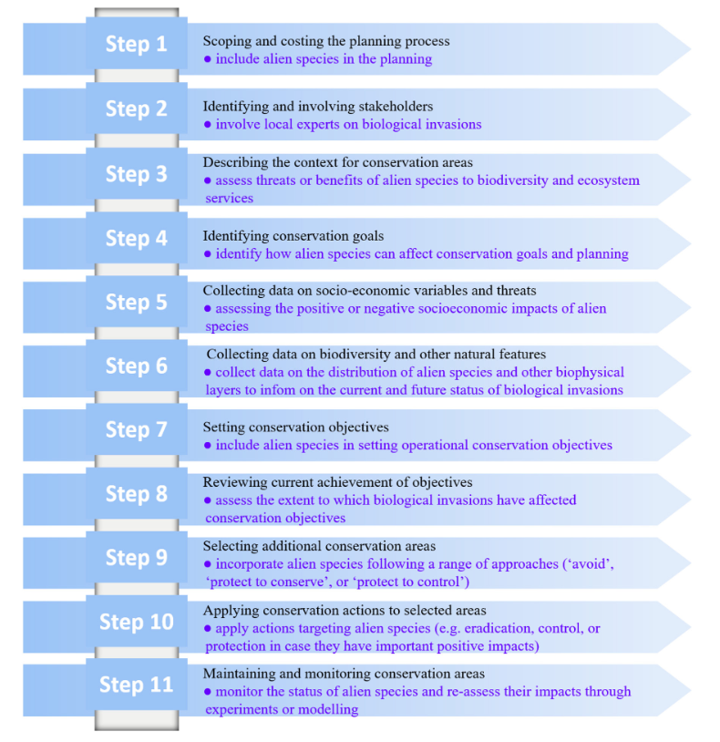

```{r setup, include=FALSE}


knitr::opts_chunk$set(echo = FALSE)

library(broom)
library(car)
library(ggplot2)
library(ggrepel)
library(ggfortify)
library(readr)
library(tidyverse)
library(vegan)

papaja::r_refs(file = "paper.bib")

options(scipen = 99) # a "trick" to keep R from using scientific notation.

options(knitr.kable.NA = "")


```

```{r import, include=FALSE}
data<-read_csv("data.csv")


data$polltype<-factor(data$polltype, 
                   levels = c('honbee', 
                              'flies',
                              'wasp',
                              'bucabee',
                              'smbee',
                              'sbutterfly',
                              'lbutterfly',
                              'beetle',
                              'ant'
                              ),
                   labels = c('Honeybee',
                              'Flies',
                              'Wasp',
                              'BUCA bee',
                              'Sm bee',
                              'Sm buttfly',
                              'Lg buttfly',
                              'Beetle',
                              'Ant'
                              )
                   )
data


view(data)

```

Current literature indicates that wild pollinator diversity has been in global decline for the last few decades with almost 1 in 4 bee species at risk of extinction [@Sena2015; @Kope2017]. Leading causes for the loss of biodiversity are from climate change and anthropogenic causes - agricultural intensification, habitat destruction and fragmentation, pesticide use, and urbanization. Diversity in early successional meadow habitats leads to diversity in pollinators by supplying multiple food sources for generalist and specialised pollinators. *Solidago spp.* are native to North America with nearly 120 species and many cultivars. It is a late season bloomer beginning around May and rapidly growing through August when it blooms and provides an alternative food source. Outside of North America, *Solidago* is a rapidly proliferating invasive species that can outcompete native species by excreting alleleopathic compounds, clonal growth, high dispersal rate, high growth rate and shading effect over other plants [@Moro2009; @Moro2021]. Understanding the impacts of invasive species on plant-pollinator diversity leads to better understanding of management practices to prevent further invasions. A small strip of *Solidago* on WCU campus was used to sample pollinator diversity and a literature review was conducted to examine the role of this plant as an invader and the management implications. 

The strip of wildflowers on WCU campus was dominated by *Solidago spp* with a few other species. When a pollinator landed on a flower for greater than 2 seconds, it counted as a "visit". If that pollinator visited another flower, it counted as a second "visit". Nineteen observers surveyed a one meter transect of wildflowers for two ten-minute intervals for a total of 38 observations of 1136 flower visits. Nine species types were identified - honeybees, bumble and carpenter bees, small bees, wasps, small butterflies, large butterflies, beetles, flies, and ants. Data were compiled and Shannon's Diversity Index was calculated using Omni calculator to estimate pollinator diversity [@Omni]. 

```{r boxplot, echo=FALSE, message=FALSE, warning=FALSE}
#| fig.cap="Pollinator abundance and diversity curve for a strip of wildflowers dominated by Solidago species on WCU campus. Boxes are color coordinated to pollinator type with the thicker bar depicting the mean number of visits. Dots indicate possible outlying data points. Shannon Diversity Index = 1.89 ans species evenness = 0.845. Figure generated from 38 observations of 1136 total pollinator flower visits.",
#| out.width="200%",
#| fig.align="center"

                   
box<- ggplot(data) +
  geom_boxplot(aes(x = polltype, 
                 y = visits, 
                 group = polltype, 
                 color = polltype
                 )
             ) +
  scale_y_continuous(
    name='Number of Flower Visits'
    )+
  scale_x_discrete(
    name='Pollinator Type'
    )+
  theme_classic(base_size=10)+
  theme(legend.position="none")

box

```

Data shows that pollinator diversity is low (Shannon's H = 1.89) and abundance is dominated by honeybees, flies, and wasps (Evenness = 0.845). The data in Figure \@ref(fig:boxplot) indicates that while diversity is low, pollinator abundances are similar in value. Since this is a small sample size only limited conclusions can be drawn about management of *Solidago* in its native environment. Future research on this species in its native environment could provide detail about management where it is considered invasive. 

@Moro2009 identify *Solidago spp* as the most successful invasive species in Europe following its introduction from North America in the 19th Century and rapid expansion in the 1950s. The authors found that increasing *Solidago* cover had a strong negative affect on native species richness and percent cover. *Solidago* effectively outcompetes native plants due to allelopathy, clonal growth, rapid growth rate, and numerous wind dispersed seeds that readily germinate in a variety of soils [@Moro2009; @Moro2021]. Meadows invaded bby *Solidago* showed significantly lower numbers of individuals and species versus uninvaded meadows. The most consistent negative effect was seen in butterflies, followed by a strong negative effect in hoverflies in flowering and non-flowering periods, and bee abundance negatively affected by *Solidago* cover. The also show that *Solidago* may positively effect honeybees by supplying an additional source of pollen and nectar during the later part of the season. This result is consistent with the WCU data and @Moro2009 and @Moro2021 identify pollinator species with large bodies, high dispersal, or long flight duration as less prone to the negative effects of *Solidago* invasion. 

Linear and non-linear responses to *Solidago* invasion leads to a delayed and abrupt collapse of pollinator populations [@Moro2019; @Moro2021]. *Solidago* was show to have a strong negative linear impact on native plant species richness and a negative non-linear impact on pollinators. Buffering effect of food base redundancy only partially ameliorates responses in butterflies and their rapid response may lead to co-extinction of butterfly and host species [@Moro2019]. Bee species, however, were shown to have a non-linear response indicating that bees can use *Solidago* as an alternative food source. 

Management implications of *Solidago* include twice per year mowing of invaded meadows - once before the spring bloom and again after the flowering period [@Moro2009]. The authors place the second mowing during the flowering period, I suggest after to allow phenotypic mismatched species access to an alternate food source. For densely invaded meadows, reducing *Solidago* cover to about 50% would increase biodiversity for bees and less than 30% *Solidago* cover to benefit butterfly species [@Moro2019]. Conservation planning is a complex topic and invasive species or invaded areas are often "ignored" or "avoided", only 3.2% of studies accounted for invasive species in their conservation plan [@Maci2018]. It clearly evidant that invasive species are detrimental to biodiversity, however there are possible positive effects of *Solidago*, such as late season food source, that should be considered when managing invasive species. The reiterate an 11-step conservation planning protocol (Figure \@ref(fig:steps.PNG)) from @steps to include invasive species in conservation planning. 

```{r steps}
#| fig.cap = "11-step protocol for inclusion of invasive species in conservation planning from Pressey and Bottrell (2009)",
#| out.width = "100%",
#| fig.align = "center"



```

WCU campus is not exempt from urbanization and recent disturbance near the sample site is likely to confound biodiversity losses associated with *Solidago*. While this plant is native to North America, investigations regarding control of *Solidago* in its native habitat could reveal management strategies where it is invasive. As it stands management includes repeated mowing and cover limitation. Governments are also suggested to prohibit the planting of *Solidago* in its non-native habitat [@Moro2009]. Expanding public knowledge regarding invasive species is also crucial to the fight against the resulting loss in biodiversity. 


\newpage

# References